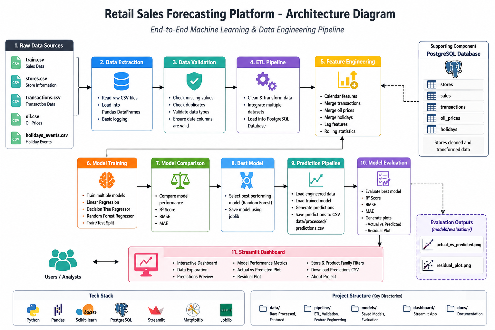
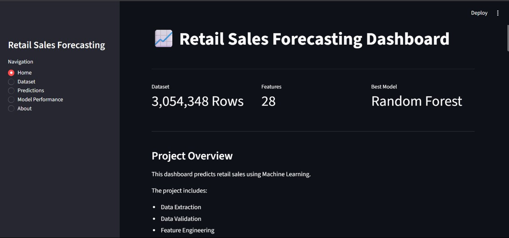
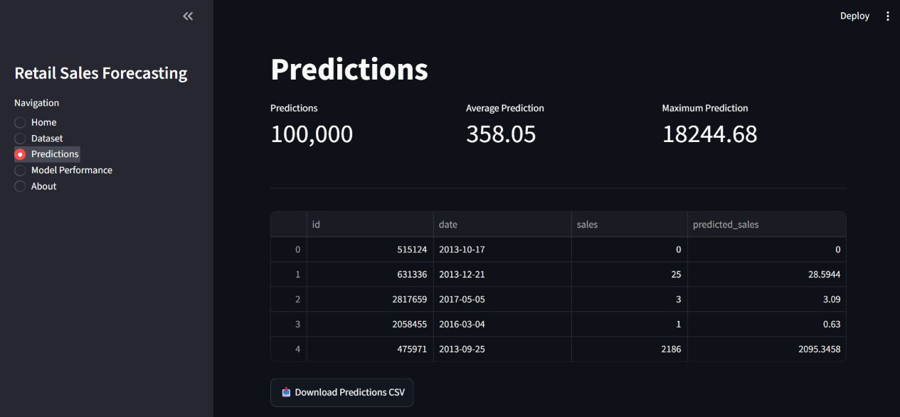
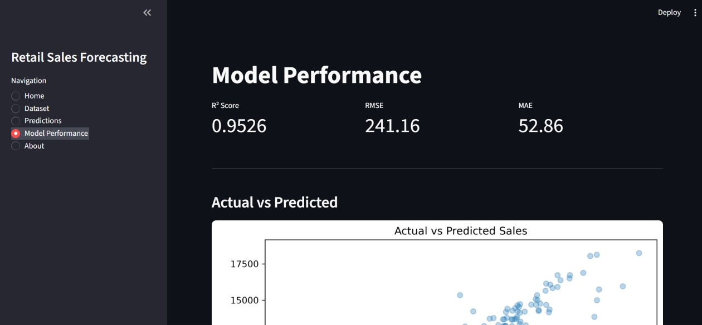

# Retail Sales Forecasting Platform

## Overview

An end-to-end Data Science and Data Engineering project for predicting retail sales using data preprocessing, feature engineering, machine learning, and an interactive Streamlit dashboard.

The project demonstrates a complete workflow from raw data processing to model training, prediction, evaluation, and visualization.

## Project Features

- Data Extraction
- Data Validation
- ETL Pipeline
- Feature Engineering
- Exploratory Data Analysis
- Machine Learning Model Training
- Model Comparison
- Sales Prediction
- Model Evaluation
- Interactive Streamlit Dashboard
- Prediction Data Export

## Project Architecture

```text
Raw Retail Data
       |
       v
Data Extraction
       |
       v
Data Validation
       |
       v
ETL Pipeline
       |
       v
Feature Engineering
       |
       v
Train / Test Split
       |
       v
Model Training
       |
       v
Model Comparison
       |
       v
Best Model
       |
       v
Prediction Pipeline
       |
       v
Model Evaluation
       |
       v
Streamlit Dashboard
```

### Architecture Diagram



## Dashboard Screenshots

### Home Dashboard



### Dataset

The project uses retail sales data containing sales, store information, transactions, oil prices, and holiday events.

Due to the large size of the dataset files, the CSV files are excluded from Git version control.

Place the raw dataset files inside:

```text
data/raw/

### Predictions



### Model Performance


